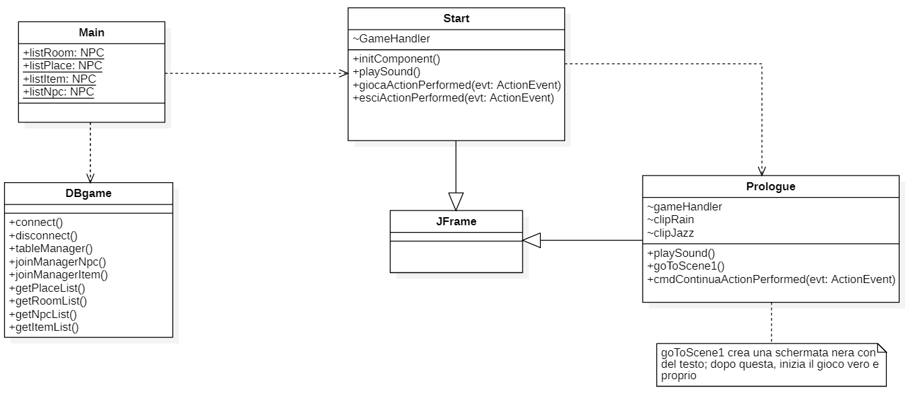
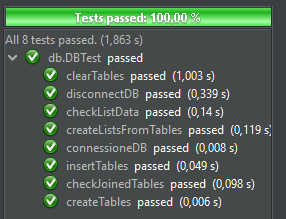

# Relazione tecnica finale

## Indice
1. [Introduzione](#introduzione)
2. [Requisiti specifici](#requisiti-specifici) 
    2.1 [Requisiti funzionali](#requisiti-funzionali) 
    2.2 [Requisiti non funzionali](#requisiti-non-funzionali)
3. [System design](#system-design) 
    3.1 [Stile architetturale adottato](#stile-architetturale-adottato) 
    3.2 [Diagramma dei package](#diagramma-dei-package)
4. [O.O. Design](#oo-design) 
    4.1 [Diagrammi delle classi e diagrammi di sequenza](#diagrammi-delle-classi-e-diagrammi-di-sequenza) 
    4.2 [Design pattern](#design-pattern) 
    4.3 [Commenti](#commenti)
5. [Riepilogo dei test](#riepilogo-dei-test) 
6. [Manuale utente](#manuale-utente)
7. [Organizzazione del lavoro](#organizzazione-del-lavoro)
8. [Note finali](#note-finali) 

---

## Introduzione
*The body in the library* è un'applicazione realizzata con il linguaggio di programmazione Java con interfaccia grafica (Swing). 
Il programma si presenta come un gioco puramente punta-e-clicca in cui bisogna risolvere un omicidio tratto dall'omonimo libro di Agatha Christie. 

Il progetto è stato realizzato durante il corso di Metodi Avanzati di Programmazione (A.A. 2020/2021) da:
- [Giacomo Signorile](https://github.com/GiacomoSignorile)
- [Tommaso Perniola](https://github.com/t-perniola)
- [Ester Molinari](https://github.com/burraco135)

[Torna su](#indice)

## Requisiti specifici
Di seguito sono riportati i requisiti funzionali seguiti dai requisiti non funzionali.

### Requisiti funzionali
- **Spostarsi tra una stanza e l'altra**
    - *Criteri di accettazione:*
        - Click sinistro sulle frecce a video;
- **Interagire con gli NPC**
    - *Criteri di accettazione:*
        - Click sinistro sulla figura dell'NPC
        - Doppio click sinistro a fine dialogo
- **Interagire con gli oggetti**
    - *Criteri di accettazione:*
        - Click sinistro sull'oggetto di scena
        - Click destro sull'oggetto nell'inventario
- **Riprodurre musica ed effetti sonori**
    - *Criteri di accettazione:*
        - Avviare il programma, bussare alle porte

### Requisiti non funzionali
L'applicazione funziona con versioni uguali o superiori a Java 8 e utilizza una codifica UTF-8. 
L'applicazione è strutturata in modo tale da evitare eccezioni sui dati contenuti nel database (h2) e nei file (<code>.txt</code>). 
L'applicazione è suddivisa semanticamente in 3 diversi package: <code>db</code>, <code>game</code> e <code>type</code>. In questo modo viene resa meno complessa la manutenzione della stessa. 

[Torna su](#indice)

## System design

### Stile architetturale adottato
Abbiamo adottato lo stile architetturale *Model-View-Controller* nella sua variante *Entity-Control-Boundary*. Essi sfruttano la prospettiva dell'utente, mettendo in evidenza le funzionalità del sistema, così come le percepisce chi interagisce dal mondo esterno. 
Per questi motivi, abbiamo strutturato il progetto seguendo gli stereotipi di classe:
- **Entity**
    - Modello che rappresenta degli oggetti presenti all'interno del dominio
        - Player
        - Place
        - Room
        - NPC
        - Item

- **Control**
    - Modello di oggetti che determinano il modo in cui l'applicazione risponde agli input, interpreta le richieste dell'utente
        - DataHandler
        - DialogueHandler
        - ActionHandler
            - ActionHandlerGH
            - ActionHandlerMH
            - ActionHandlerPS
        - Main
        - DayDescription

- **Boundary**
    - Modello di oggetti che funge da interfaccia tra utente e sistema
        - Start
        - Prologue
        - Scene1
        - Day_Form
        - GossingtonHall
        - MajesticHotel
        - PoliceStation

- **non-ECB**
    - Modello di oggetti che non rappresenta un unico stereotipo
        - DBgame
        - Classi boundary grafiche (vedi sotto)

> Alcune classi boundary contengono dei controlli ma sono unicamente necessari per la visualizzazione grafica e sonora. Possono essere considerate boundary oppure non-ECB.

### Diagramma dei package

[Torna su](#indice)

## O.O. Design

### Diagrammi delle classi e diagrammi di sequenza

### Design pattern
Abbiamo individuato nella classe <code>DBgame</code> e nella sua unica istanza un chiaro esempio di [**Singleton**](https://it.wikipedia.org/wiki/Singleton_(informatica)), vista la necessità di creare tale istanza una ed una sola volta.

### Commenti
Non è stato semplice applicare sempre tutti i criteri del paradigma ad oggetti in quanto la parte grafica con Swing ha occupato gran parte della struttura, però nella realizzazione delle strutture dati non è stato difficile seguire i pattern. 
Abbiamo creato una classe astratta <code>ActionHandler</code> per la gestione degli eventi il cui unico metodo <code>ActionPerformed</code> viene sovrascritto da ogni sottoclasse (Override) in quanto ognuna ne fornisce una diversa implementazione. Grazie alla creazione della superclasse <code>ActionHandler</code> è stato possibile usare il **principio di sostituibilità** per la creazione dei metodi generici.

[Torna su](#indice)

## Riepilogo dei test
L'unica classe testata è <code>DBgame</code> in quanto è la classe che si occupa di fornire tutti i personaggi, gli oggetti, le mappe e le stanze di gioco. Inoltre molte frasi utilizzate in gioco vengono prese da esso. L'esecuzione dei test (8) riporta una percentuale del 100%

## Manuale utente
Torna a [Guida per l'utente](../README.md/#guida-per-lutente)

[Torna su](#indice)

## Organizzazione del lavoro

### Piattaforma di comunicazione adottata
Per completare il progetto abbiamo usato [Discord](https://discord.com/) in quanto è molto più comodo di Teams e ci ha permesso di comunicare molto rapidamente tra noi.

### Suddivisione dei compiti
Per la ricerca delle immagini, l'utilizzo di Swing, l'implementazione dell'audio nel gioco e in generale della parte visiva se ne sono occupati Perniola e Signorile (package <code>game</code>), mentre la realizzazione del database, la gestione dei dati e la lettura dei file se ne è occupata Molinari (<code>db</code>, <code>type</code>).

[Torna su](#indice)

## Note finali

### Perniola
Sono rimasto molto insoddisfatto dalla gestione della OOP e in generale della struttura del codice perchè pensavamo che implementare Swing fosse meno difficoltoso. Però sono rimasto soddisfatto dalla resa finale, nonostante tutto.

### Signorile
Mi è piaciuto molto modificare le immagini, selezionarle e creare gli sfondi per il gioco. La parte più fastidiosa è stata quella con Swing ma per il resto mi sono divertito molto.

### Molinari
Durante tutto il progetto ho imparato a gestire la build di Maven e a comprenderne meglio il suo funzionamento. Inoltre, è stato bello lavorare utilizzando Discord; ogni tanto ascoltavamo la musica tutti insieme mentre lavoravamo.

[Torna su](#indice)
